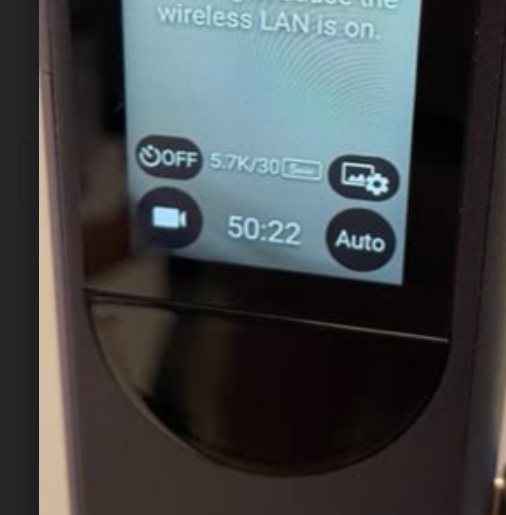

# video_wizard

This is a RICOH THETA X testing tool created by Oppkey. It has three main functions. It can turn off the LCD screen, which is required to run mobile apps with the THETA X. It can also set the THETA X video shooting mode to 8K 2fps. And it can set it to 5.7K 30fps. It should be useful for testing 8K 2fps, which is common in construction applications.

## 8K 2fps

After the button is pressed, you will get a confirmation that it is set to 8k 2fps.

This is also display on the LCD screen on the THETA X.

## 5.7K 30fps

After the button is pressed, you will get a confirmation that is it set to 5k 30fps.

This is also displayed on the LCD screen on the THETA X.
